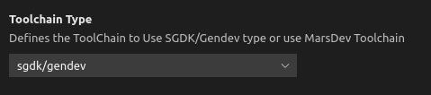
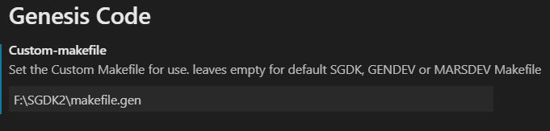
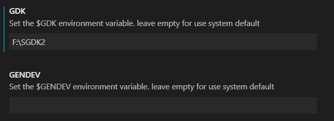
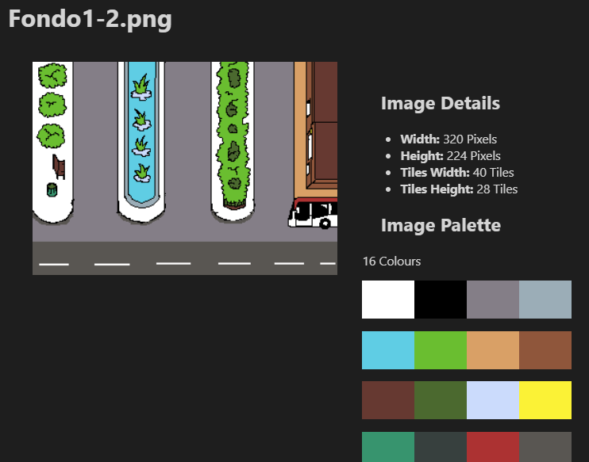

# Genesis-code Extension

    

Genesis-Code is a Visual Studio Code Extension for Sega Genesis/ Mega Drive development. This extension is created for use with the [SGDK](https://github.com/Stephane-D/SGDK)/[GENDEV](https://github.com/kubilus1/gendev) or [MARSDEV](https://github.com/andwn/marsdev) projects for create homebrew games for the Sega 16 bits console.

For more information, see [Genesis Code Documentation Web Page](https://zerasul.github.io/genesis-code-docs/)

If you want to know how to develop Mega Drive Games; You can see the "16 Bits Homebrew Development" Book available on Amazon: [Spanish Version](https://amzn.eu/d/1GDGkhA), English Version(Coming Soon).

## Features

With this extension, you can use easily a few commands for help you create awesome games. This extension adds the following commands:

* Compile command: compile the program and generate the Rom file.
* Run command: You can use an emulator like Gens to run and test your game.
* Clean command: Clean the programs build folder (calls makefile with clean).
* Compile & Run command: first compile and later run the rom.bin file in an emulator.
* Create project: Select a folder and create a Hello World project ready for compile and run.
* Set Gens Command: Update the configuration and adds the command path to run Gens Emulator.
* Compile For debug command: Compile the project with debug options.
* SGDK Resource Files Code Completion.
* Added remote debugging configuration for use with GDB.
* Compatible with [MarsDev](https://github.com/andwn/marsdev) Toolchain.
* Import TMX file command: Uses a [TMX file format](https://doc.mapeditor.org/en/stable/reference/tmx-map-format/) for generate a C header file for your projects.
* Import Json TMX file command: Uses a [Tmx Json File Format](https://doc.mapeditor.org/en/stable/reference/json-map-format/) for generate a C Header file for Your project).
* Added configuration for use alternative MakeFile.
* Added configuration for use alernative environment variables for GDK, GENDEV or MARSDEV.
* Added Genesis Code: About for open more information about the extension.
* Added BitmapViewer.
* Added Docker Support.

## Requirements

To use this extension you need to install SGDK(windows)/GENDEV(linux) or MARSDEV projects on your system and configure the GDK, GENDEV or MARSDEV enviroment variables, or build a SGDK Docker Image.

## Extension Settings

You can set the [Gens Emulator](http://www.gens.me/) command to call it directly from the Genesis Code Extension (Run Command).

You can set it via command , or using the settings configuration.

**NOTE**: You can use another emulators like [Blastem](https://www.retrodev.com/blastem/).

You can select the toolchain type for use with genesis code:

* SGDK/GENDEV: the SGDK libs and GENDEV (On Linux) will be used with Genesis Code.
* MARSDEV: The MARSDEV project will be used with Genesis Code.
* DOCKER: Use a SGDK Docker container for compiling.

You can set an alternative MakeFile on the configuration panel. When the compile or clean command is called the alternative Makefile will be used instead the default makefile.

Also, you can set an alternative value for the environment variables of GDK, GENDEV or MARSDEV.

Now, you can define a custom docker image tag for generate a new container.

**NOTE:** If you want to use [Doragasu SGDK Docker Image](https://gitlab.com/doragasu/docker-sgdk), you can use the check in Configuration and you must add the current Docker Image Tag description (with the gitlab registry URL).

## Bitmap Viewer

Now you can use the Bitmap Viewer; with some information of the images. You can open as alternative viewer on VSCODE (right click and Reopen Editor... on tab).

## Known Issues

* In MacOs the _compile & Run project_ command, the emulator is not running in background. We are working in this issue.
* In Linux systems, you can't compile with debug options using SGDK/GENDEV toolchain.
* In Linux Systems, when you create a new project there is no launch.json file for SGDK/GENDEV toolchain.
* On MacOs Systems, for the SGDK/GENDEV ToolchainType you can't use custom Makefile or custom Environment variables; this is due to the use of Wine.

## Release Notes

### 1.5.0

* Add "Status bar Button" configuration, to add status bar buttons for the more commons commands (no more command palette).
* Added 4 Status Bar Buttons for _compile_, _compile&Run_, _compile for Debug_ and _clean_.
* Updating autocompletion and .res grammar for use with the new XGM2 Driver.
* Updating dependencies.

### 1.4.2

* Updating grammar for use SGDK 1.80 with the last documentation.
* Fix Bug when create on Windows a new project the settings are not properly point to SGDK include Folders.
* Fix Multiple Instances of gens.code error.
* Updated dependencies.

### 1.4.1

* Added Support for Dogarasu SGDK Docker Image.
* Added Configuration Flag for Dogarasu SGDK Docker Image.
* Fix Gens.code Multiples Instances Error.
* Updated Rescomp Context Help Information for the Last Version of SGDK (Supports 1.70).
* Updated Dependencies.

### 1.4.0

* Added Docker container Support.
* Improved Code with a total Refactoring.
* SGDK resource files now have regions
    * They start with *#region* / *#pragma region*
    * They end with *#endregion* / *#pragma endregion*
* Fixed some syntax highlighting errors related with numbers

**NOTE:** Thanks to our contributors on the HacktoberFest 2021 and for the last contributors with the File resource Grammar improvements.

### 1.3.3

* Added SGDK 1.65 Support.
* Updating use of Wine for Wine64 (Only MacOs).
* Added Bitmap Viewer for Bmp,Png and JPEG images.

### 1.3.2

* Added Support for SGDK 1.60 Map resources in res files.
* Changed default main.c generation for use the new functions for SGDK 1.60.
* Added comment higthlingthing on res files.
* Fixed a bug that the Run command dosen't works if the path have spaces characters.
* Added Genesis Code: About command. This command shows information about Genesis Code extension.
* Updated some dependencies.

### 1.3.1

* Fixed a bug with some dependencies (Import TMX format ins't works).
* Fixed some code smells reported by sonar.

### 1.3.0

* Added import TMX file command; it generates a C Header File with the information of the TMX file. For more info about the TMX format, please see [Tiled Documentation](https://doc.mapeditor.org/en/stable/reference/tmx-map-format/).
* Added import Json Tmx File command; it generates a C Header File with the information of the json TMX file. For more info about the json Tmx Format, please see [Tiled Documentation](https://doc.mapeditor.org/en/stable/reference/json-map-format/).
* Added custom makefile configuration; now you can set an alternartive for the default makefile.
* Added configuration for GDK, GENDEV or MARSDEV custom variables.
* Updated some dependencies and improved code.

### 1.2.2

* Updated for use with SGDK 1.51; added new features for SGDK Resource Files autocompletion (for use with the last version of rescomp tool).
* Fixed some bugs and improved code.
* Updated some dependencies and updating package-lock.json.

### 1.2.1

* Updated for use with SGDK 1.50; added new features for SGDK Resource Files autocompletion (for use with the last version of rescomp tool).
* Now when you create a new Project a settings.json file is created with the default include paths.
* Added Debuggers category to Package.json.
* Updated some dependencies and updating package-lock.json.

### 1.2.0

* Added [Marsdev](https://github.com/andwn/marsdev) toolchain compatibility. Now you can use the marsdev toolchain with genesis code. For more information please see [Genesis code Documentation Web](https://zerasul.github.io/genesis-code-docs/).
* Added configuration for debugging. Now when you create a new project a launch.json is created. For more information please see [Genesis code Documentation Web](https://zerasul.github.io/genesis-code-docs/debug/).
* Now you can select your toolchain from the genesis code Settings; SGDK/GENDEV toolchain or MARSDEV toolchain.
* Added Compile with Debug Options command.
* Updated dependencies and improving code.

### 1.1.1

* Added SGDK Resource Files Autocomplete feature. Now we have contextual help for the SGDK Resource Files, see [Genesis code Documentation web](https://zerasul.github.io/genesis-code-docs/otherfeatures/) for more information.
* Fixed a typo error on the main.c autogenerated file when we create a new Project.
* Updated depdendencies and improving tests.

### 1.1.0

* Adding MACOs Support. Now you can use genesis code using wine. For more information please see [Genesis code Documentation](https://zerasul.github.io/genesis-code-docs/).
* Added Syntax HighLingthing for SGDK Resource Files (.res).
* Updated dependencies.

### 1.0.1

* Fixed a bug with create new project that dosent show properly the readme.md file.
* Fixed a bug with create new project that dosent include 'res' and 'inc' directories into git repository.
* Updating dependencies of the extension.

### 1.0.0

Initial Release:

* Added Compile command.
* Added Run command.
* Added Clean command.
* Added Compile & Run command.
* Added Create Project command.
* Added Set Gens Emulator Command.

-----------------------------------------------------------------------------------------------------------

You can support this project using [Buy Me a Coffee](https://www.buymeacoffee.com/zerasul).

**Enjoy!**
